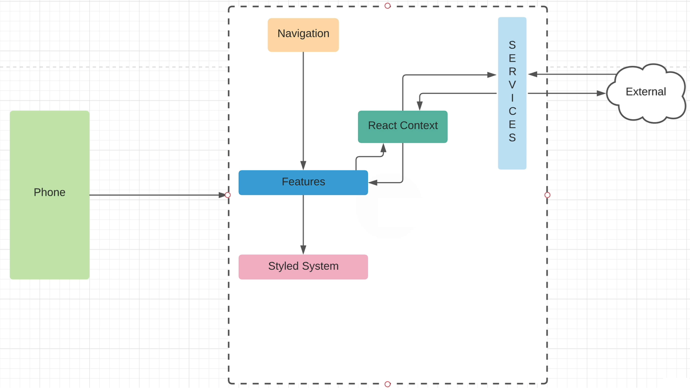

# React Native - Meals To Go

## GitHub repository

https://github.com/nirgluzman/React-Native-MealsToGo.git <br />
https://github.com/mobinni/MealsToGo.git

## Architecture



## React Native Cheat Sheet

https://zerotomastery.io/cheatsheets/react-native-cheat-sheet/

## Expo

https://docs.expo.dev/

- Expo is a framework that makes developing Android and iOS apps easier.

- Create a new project using the blank template with TypeScript enabled,
  https://docs.expo.dev/more/create-expo/#--template

```bash
yarn create expo-app --template blank-typescript

```

## Expo Go

https://expo.dev/go

- Expo Go is a sandbox environment which enables you to quickly experiment with building native
  Android and iOS apps.
- Expo Go app comes with pre-installed commonly used libraries so you can quickly prototype and
  develop your app.
- **Expo Go Limitations** - we can only use libraries bundled in Expo Go !!
- [React Native Directory](https://reactnative.directory/) to check if a library is compatible with
  Expo Go.

## Set up ESLint in VS Code for React Native applications that use TypeScript

https://typescript-eslint.io/ <br /> https://docs.expo.dev/guides/using-eslint/

- ESLint statically analyzes your code to quickly find problems.

## React Native Paper

https://callstack.github.io/react-native-paper/

- A collection of customizable and production-ready components for React Native, following Google’s
  Material Design guidelines.
- Convert CSS to React Native stylesheet object,
  https://github.com/styled-components/css-to-react-native

## React Native Maps / MapView

https://docs.expo.dev/versions/latest/sdk/map-view/ <br />
https://github.com/react-native-maps/react-native-maps (full documentation)

- A library that provides a Map component that uses Google Maps on Android and Apple Maps or Google
  Maps on iOS.

- **Note:** Currently, `react-native-maps` does not support the New Architecture (SDK 52 or newer) !

- **Solution:** Disable the New Architecture (`newArchEnabled: false`) in `app.json` and create a
  [development build](https://docs.expo.dev/develop/development-builds/create-a-build/). As we
  create our own custom build, we must to configure the Google Maps API key within
  `android.config.googleMaps.apiKey` field.

[Android callouts are cut off](https://github.com/react-native-maps/react-native-maps/issues/5216)
<br />
[Android map not working correctly](https://github.com/react-native-maps/react-native-maps/issues/5236)

## Styled Components (React and React Native)

https://styled-components.com/

- `Styled-Components` is a library for React that allows you to write your CSS directly in your
  javascript.
- `yarn` is required for installation, as it seems that `npm` does not work correctly for this
  package.

```bash
yarn add styled-components
yarn add -D @types/styled-components-react-native
```

## Safe Area Context

https://docs.expo.dev/versions/latest/sdk/safe-area-context/ <br />
https://docs.expo.dev/develop/user-interface/safe-areas/

- Creating a safe area ensures your app screen's content is positioned correctly. This means it
  doesn't get overlapped by notches, status bars, home indicators, and other interface elements that
  are part of the device's physical hardware or are controlled by the operating system.
- `react-native-safe-area-context` provides a flexible API for accessing device safe area inset
  information. This allows you to position your content appropriately around notches, status bars,
  home indicators, and other such device and operating system interface elements.
- It also provides a `SafeAreaView` to render content within the safe area boundaries of a device.
- It's generally recommended to include `StatusBar` within `SafeAreaView` that is nested within a
  `SafeAreaProvider`.

## React Native StatusBar

https://reactnative.dev/docs/statusbar

- Component to control the app's status bar.
- E.g. `currentHeight` returns the height of the status bar (only in Android; returns `null` in
  iOS).

## React Navigation

https://reactnavigation.org/

- Library to implement navigation functionality in a React application.

- A `Navigator` is a React component that decides how to render the screens we have defined. It
  contains `Screen` elements as its children to define the configuration for screens.

## Typechecking the Navigator

https://reactnavigation.org/docs/typescript/

- React Navigation can be configured to type-check screens and their params, as well as various
  other APIs using TypeScript.

## Async Storage - Persist data locally on the user's device

https://react-native-async-storage.github.io/async-storage/ </br>
https://github.com/react-native-async-storage/async-storage

- Asynchronous, unencrypted, persistent, key-value storage solution for your React Native
  application.
- Async Storage can only store string data. In order to store object data, you need to serialize it
  first.

## Layout with Flexbox

https://reactnative.dev/docs/flexbox#flex

## React Native - TouchableOpacity vs. Pressable

https://reactnative.dev/docs/touchableopacity <br /> https://reactnative.dev/docs/pressable

- `TouchableOpacity` primarily focuses on providing visual feedback by reducing the opacity of the
  component when it is pressed.
- `Pressable` is a more versatile and highly customizable component that provides more control over
  touch interactions.

## Rendering lists - FlatList & ScrollView

https://reactnative.dev/docs/flatlist <br /> https://reactnative.dev/docs/scrollview

- `FlatList` is a component optimized for handling large lists of data; it efficiently renders only
  the visible items on the screen, conserving memory and improving performance.
- The `FlatList` component also provides scrolling, pull-to-refresh, and item selection features.
- A `ScrollView` is a scrolling container, but it's not ideal as a container for mapping over a
  large collection of list items. This is because it will render the entire list of elements whether
  they're on-screen or not. A `FlatList` component only renders items on screen, which helps improve
  app performance for long lists.

## Expo Vector Icons

https://docs.expo.dev/guides/icons/

- The `@expo/vector-icons` library is installed by default and it includes popular icon sets from
  https://icons.expo.fyi/
